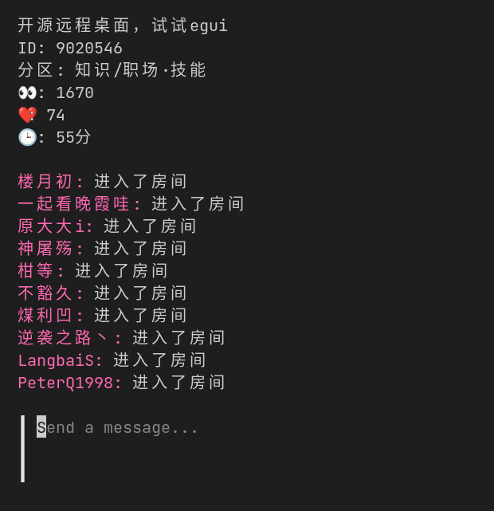

# bilibili_live_tui

本项目 fork 自 [bilibili_live_tui](https://github.com/yaocccc/bilibili_live_tui)

在原版的基础上，修改 UI 框架为[bubbletea](https://github.com/charmbracelet/bubbletea)，更好看了。

增加了扫码登陆功能，不需要手动去复制 cookie 了。

当配置文件中没有指定房间号时，会让用户手动输入房间号，更方便了。

## UI 截图

